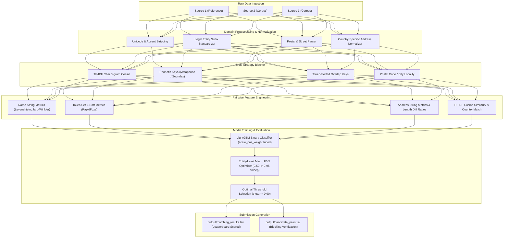

# Amazon ML Challenge 2026: Multilingual Business Entity Resolution

An end-to-end, high-performance Entity Resolution (ER) system designed for the Amazon ML Challenge 2026. The objective is to identify matching business records across multiple noisy, heterogeneous data sources (Source 1, Source 2, Source 3) spanning multiple countries (**US**, **India**, and **France**).

The solution optimizes the official competition metric: **Macro-Averaged $F_{0.5}$** across all Source 1 entities, including singletons:
$$F_{0.5} = \frac{1.25 \cdot \text{Precision} \cdot \text{Recall}}{0.25 \cdot \text{Precision} + \text{Recall}}$$

---

## 🏆 Key Results

- **Held-Out Validation Macro $F_{0.5}$**: **`0.8017`** (80.17%)
- **Optimal Decision Threshold ($\theta^*$)**: **`0.90`**
- **Validation Macro Precision**: **`0.8670`** (86.70%)
- **Validation Macro Recall**: **`0.7045`** (70.45%)
- **Validation Singleton Accuracy**: **`74.46%`**
- **Country Performance**:
  - **US**: **`0.8355`** Macro $F_{0.5}$
  - **India**: **`0.7511`** Macro $F_{0.5}$
- **Leaderboard Submission**: Validated with `utils/validate_submission.py` (`PASS — no blocking issues found`).

---

## 🏗️ Architecture & Pipeline Overview



---

## 📁 Repository Structure

```text
├── src/
│   ├── normalization.py             # Unicode, leet-speak, and business name normalization
│   ├── address_normalization.py     # Parsing for street numbers, PIN codes, states, landmarks
│   ├── process_all_sources.py       # Batched preprocessing for train/test datasets
│   ├── blocking.py                  # Multi-strategy blocking engine (TF-IDF, Phonetic, Address)
│   ├── evaluate_blocking.py         # Recall ceiling, reduction ratio, and candidate diagnostics
│   ├── generate_candidates.py       # Parallel multiprocess candidate pair generation
│   ├── features.py                  # RapidFuzz string metrics & TF-IDF pairwise features
│   ├── create_split.py              # Stratified entity-level train/validation split
│   ├── train.py                     # LightGBM classifier training with imbalanced learning
│   ├── evaluate.py                  # Official Macro F0.5 evaluation & threshold sweep
│   └── inference.py                 # Test inference & submission TSV generator
├── tests/                           # 43 automated unit tests
│   ├── test_normalization.py
│   ├── test_address_normalization.py
│   ├── test_blocking.py
│   ├── test_features.py
│   ├── test_train.py
│   ├── test_evaluate.py
│   └── test_inference.py
├── notebooks/                       # Analysis reports and diagnostics
│   ├── country_patterns.md          # Noise patterns in US vs India records
│   ├── eda_report.md                # Dataset statistics, singleton distributions
│   ├── blocking_evaluation_report.md# Blocker recall & reduction ratios
│   └── entity_evaluation_report.md  # Validation threshold sweep & metrics
├── utils/
│   └── validate_submission.py       # Official competition submission validator
├── output/                          # Generated submission TSVs (git-ignored)
│   ├── matching_results.tsv
│   └── candidate_pairs.tsv
├── requirements.txt                 # Python dependencies
└── README.md
```

---

## 🚀 Setup & Reproduction Guide

### 1. Installation

```bash
# Clone the repository
git clone <YOUR_GITHUB_REPO_URL>
cd amazon-ml-challenge

# Create and activate virtual environment
python3 -m venv .venv
source .venv/bin/activate

# Install dependencies
pip install -r requirements.txt
```

### 2. Run Automated Unit Tests

```bash
python -m unittest discover tests
# 43 tests passing
```

### 3. Execution Pipeline

```bash
# Step 1: Preprocess raw sources into normalized parquet files
python src/process_all_sources.py

# Step 2: Generate candidate pairs via multi-strategy blocking
python src/generate_candidates.py --queries-path data/processed/train_source1.parquet --split-path data/processed/train_val_split.json --split-name train --output candidate_pairs_train.parquet
python src/generate_candidates.py --queries-path data/processed/test_source1.parquet --output candidate_pairs_test.parquet

# Step 3: Compute pairwise feature matrices
python src/features.py --pairs-file candidate_pairs_train.parquet --output feature_matrix_train.parquet --is-train
python src/features.py --pairs-file candidate_pairs_test.parquet --output feature_matrix_test.parquet

# Step 4: Train LightGBM classifier
python src/train.py --feature-matrix feature_matrix_train.parquet --split-file data/processed/model_train_val_split.json

# Step 5: Evaluate Macro F0.5 & sweep thresholds
python src/evaluate.py --model models/lgbm_matcher.pkl --feature-matrix feature_matrix_train.parquet --split-file data/processed/model_train_val_split.json

# Step 6: Run test inference and generate submission files
python src/inference.py --model models/lgbm_matcher.pkl --feature-matrix feature_matrix_test.parquet

# Step 7: Validate submission files
python utils/validate_submission.py --matching output/matching_results.tsv --candidate output/candidate_pairs.tsv --test-dir dataset/test
```

---

## 📄 License

This repository is built for the Amazon ML Challenge 2026.
