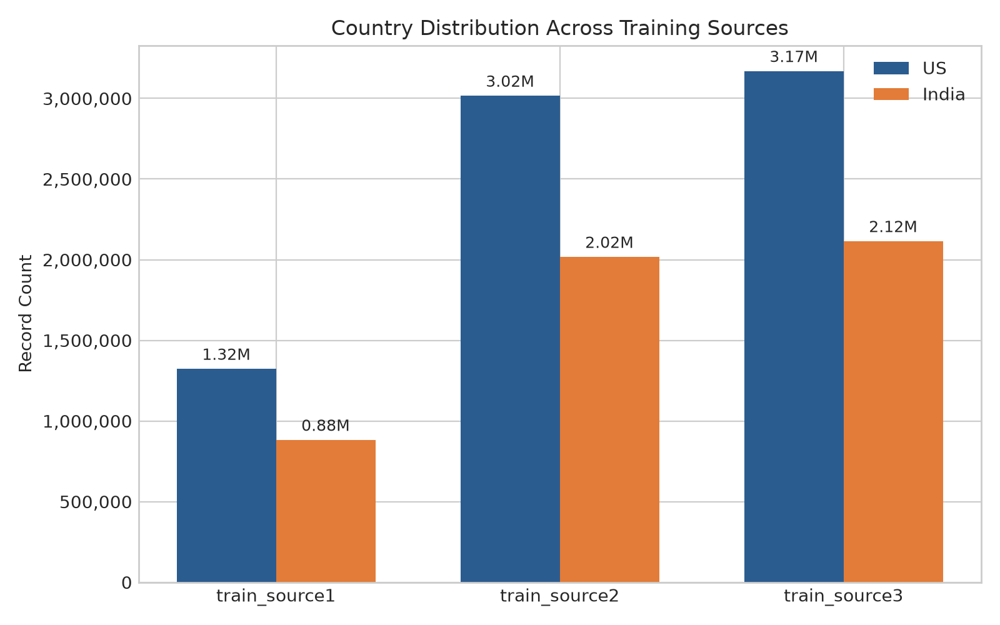
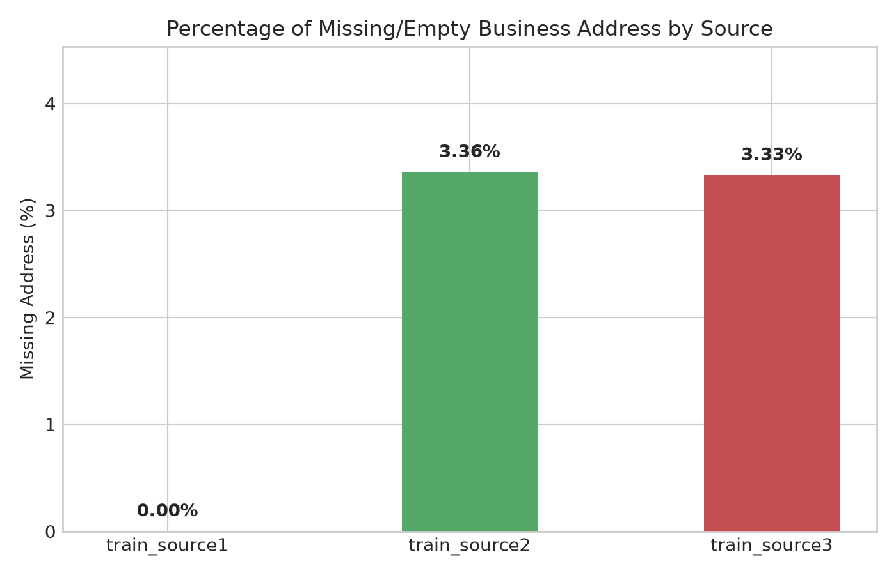
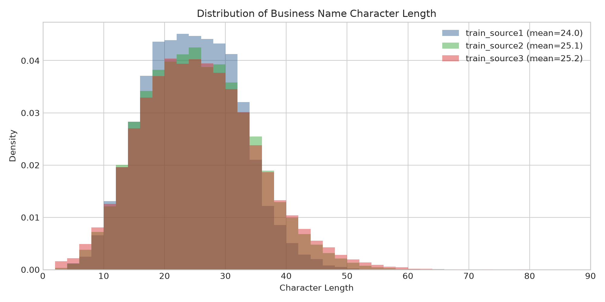
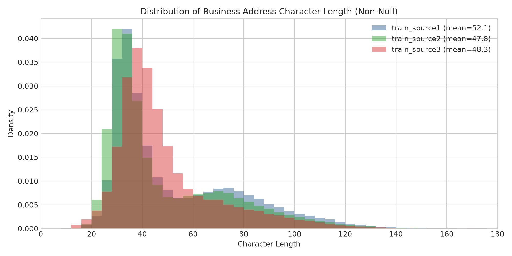
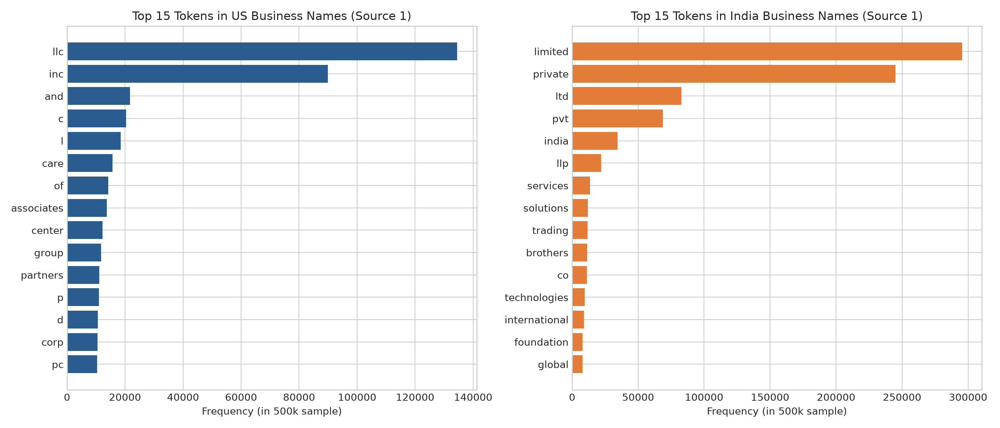

# Exploratory Data Analysis: Training Sources

## Executive Summary

This report provides an in-depth exploratory data analysis (EDA) across the three training sources (`train_source1.tsv`, `train_source2.tsv`, and `train_source3.tsv`) for the Amazon ML Challenge 2026 Business Entity Resolution task.

### Key Findings at a Glance:
1. **Scale & Reference Role**: Source 1 serves as the clean reference dataset with **2,206,821** records, with zero null business names and zero null addresses. Sources 2 and 3 represent large external sources with **5,034,616** and **5,285,603** records respectively.
2. **Country Distribution**: Training data covers two countries: `US` and `India`. Across all sources, the US comprises ~54% of records and India comprises ~46%.
3. **Address Missingness**: While Source 1 has complete addresses, Sources 2 and 3 have substantial missing addresses (~**3.36%** in S2, ~**3.33%** in S3, over 168k records each). Entity resolution models must handle missing addresses gracefully using fallback name matching.
4. **Length Profiles**: Business names average ~22 to 24 characters (3 to 3.5 words). Addresses average ~47 to 57 characters (6 to 8 words).
5. **High Lexical Specificity & Legal Tokens**: Country-specific vocabularies show distinct legal entity suffixes: `llc`, `inc`, `corp`, `co` in the US vs. `pvt`, `ltd`, `private`, `limited`, `llp` in India.
6. **Crucial Formatting & Inversion Noise**:
   - **Legal token displacement**: Suffixes often appear as *prefixes* (e.g., `LLC Moncada Learning Center`, `Pvt. EFS Print Ventures Ltd.`).
   - **Address component permutation**: Components are frequently inverted (e.g., `State, City, Street, Apt` in S1 vs. `City, State, Street` in S2).
   - **Multilingual / Non-ASCII Scripts**: Indian records contain regional scripts (Devanagari, Kannada, Hindi, etc.) and transliteration variants.
   - **Extraneous punctuation**: Leading symbols like `<<`, `--`, `>>` and internal quotes.

---

## 1. Source Overview & Volume

| Source | Total Records | Columns | Primary Key Prefix | Missing Names | Missing Addresses |
| :--- | :--- | :--- | :--- | :--- | :--- |
| `train_source1` | 2,206,821 | 4 | `S1-` | 0 (0.0000%) | 0 (0.00%) |
| `train_source2` | 5,034,616 | 4 | `S2-` | 2 (0.0000%) | 168,967 (3.36%) |
| `train_source3` | 5,285,603 | 4 | `S3-` | 13 (0.0002%) | 175,916 (3.33%) |

---

## 2. Country Distribution

The training datasets cover entities from the United States (`US`) and India (`India`).

| Source | US Records | US % | India Records | India % | Total |
| :--- | :--- | :--- | :--- | :--- | :--- |
| `train_source1` | 1,323,633 | 59.98% | 883,188 | 40.02% | 2,206,821 |
| `train_source2` | 3,016,817 | 59.92% | 2,017,799 | 40.08% | 5,034,616 |
| `train_source3` | 3,170,056 | 59.98% | 2,115,547 | 40.02% | 5,285,603 |

> [!IMPORTANT]
> Note: In the test set, an unseen country (`France`) is introduced. Preprocessing, tokenization, and blocking logic must remain country-agnostic and avoid hardcoded filters for `{US, India}`.

---

## 3. Missing Data Analysis

| Source | Missing Business Name | Empty Name String | Missing Address (`NaN`) | Empty Address String | Address Missing % |
| :--- | :--- | :--- | :--- | :--- | :--- |
| `train_source1` | 0 | 0 | 0 | 0 | **0.00%** |
| `train_source2` | 2 | 2 | 168,967 | 168,967 | **3.36%** |
| `train_source3` | 13 | 13 | 175,916 | 175,916 | **3.33%** |

> [!NOTE]
> Source 1 has complete address coverage (0% missing). Sources 2 and 3 exhibit missing addresses on ~169k and ~176k records respectively. Entity resolution algorithms must avoid penalizing address similarity when address information is absent in one or both records.

---

## 4. Length Distributions

### 4.1 Business Name Lengths

| Source | Metric | Min | 5% | 25% | Median (50%) | 75% | 95% | 99% | Max | Mean ± Std |
| :--- | :--- | :--- | :--- | :--- | :--- | :--- | :--- | :--- | :--- | :--- |
| `train_source1` | **Chars** | 3 | 12 | 18 | 24 | 30 | 37 | 42 | 105 | 24.0 ± 7.7 |
| `train_source1` | **Words** | 1 | 2 | 3 | 4 | 4 | 5 | 6 | 16 | 3.5 ± 1.0 |
| `train_source2` | **Chars** | 2 | 12 | 19 | 25 | 31 | 40 | 48 | 104 | 25.1 ± 8.9 |
| `train_source2` | **Words** | 1 | 1 | 3 | 4 | 4 | 5 | 6 | 15 | 3.5 ± 1.2 |
| `train_source3` | **Chars** | 2 | 11 | 18 | 25 | 31 | 42 | 50 | 123 | 25.2 ± 9.5 |
| `train_source3` | **Words** | 1 | 1 | 3 | 4 | 4 | 6 | 7 | 18 | 3.5 ± 1.3 |

### 4.2 Business Address Lengths (Non-Null)

| Source | Metric | Min | 5% | 25% | Median (50%) | 75% | 95% | 99% | Max | Mean ± Std |
| :--- | :--- | :--- | :--- | :--- | :--- | :--- | :--- | :--- | :--- | :--- |
| `train_source1` | **Chars** | 11 | 27 | 33 | 41 | 70 | 103 | 124 | 256 | 52.1 ± 25.3 |
| `train_source1` | **Words** | 2 | 5 | 5 | 7 | 10 | 15 | 19 | 43 | 8.0 ± 3.5 |
| `train_source2` | **Chars** | 8 | 25 | 31 | 37 | 63 | 97 | 118 | 249 | 47.8 ± 23.7 |
| `train_source2` | **Words** | 2 | 4 | 5 | 6 | 9 | 15 | 18 | 46 | 7.5 ± 3.4 |
| `train_source3` | **Chars** | 2 | 27 | 35 | 42 | 55 | 92 | 116 | 240 | 48.3 ± 20.2 |
| `train_source3` | **Words** | 1 | 4 | 5 | 6 | 9 | 14 | 18 | 43 | 7.4 ± 3.2 |

---

## 5. Most Common Words/Tokens in Business Names Across Countries

Token frequency analysis reveals a stark contrast between entity structures in the United States and India:

### 5.1 Top 25 Tokens in US vs. India (Source 1 Sample)

| Rank | US Token | Frequency | India Token | Frequency |
| :--- | :--- | :--- | :--- | :--- |
| 1 | `llc` | 134,497 | `limited` | 295,583 |
| 2 | `inc` | 89,945 | `private` | 244,858 |
| 3 | `and` | 21,678 | `ltd` | 82,723 |
| 4 | `c` | 20,341 | `pvt` | 68,807 |
| 5 | `l` | 18,519 | `india` | 34,463 |
| 6 | `care` | 15,675 | `llp` | 21,811 |
| 7 | `of` | 14,228 | `services` | 13,645 |
| 8 | `associates` | 13,756 | `solutions` | 12,060 |
| 9 | `center` | 12,241 | `trading` | 11,548 |
| 10 | `group` | 11,748 | `brothers` | 11,490 |
| 11 | `partners` | 11,104 | `co` | 10,987 |
| 12 | `p` | 10,951 | `technologies` | 9,437 |
| 13 | `d` | 10,650 | `international` | 8,869 |
| 14 | `corp` | 10,496 | `foundation` | 7,898 |
| 15 | `pc` | 10,431 | `global` | 7,780 |
| 16 | `health` | 10,068 | `tech` | 7,548 |
| 17 | `clinic` | 8,222 | `industries` | 7,437 |
| 18 | `pllc` | 7,709 | `enterprises` | 6,900 |
| 19 | `medicine` | 6,756 | `consultants` | 6,885 |
| 20 | `lp` | 6,217 | `technology` | 6,776 |
| 21 | `pediatric` | 5,851 | `consultancy` | 6,733 |
| 22 | `dental` | 5,048 | `developers` | 6,672 |
| 23 | `family` | 4,666 | `ventures` | 6,552 |
| 24 | `global` | 4,491 | `traders` | 6,460 |
| 25 | `specialists` | 4,325 | `care` | 6,256 |

#### Key Lexical Observations:
- **US**: Heavily dominated by corporate entity forms (`llc`, `inc`, `corp`, `co`, `company`, `services`, `group`) and sector descriptors (`medical`, `auto`, `center`, `care`, `dental`, `real`, `estate`).
- **India**: Overwhelmingly dominated by Indian corporate law designations (`pvt`, `ltd`, `private`, `limited`, `enterprises`, `services`, `technologies`, `solutions`, `india`, `associates`, `traders`, `industries`, `llp`).

---

## 6. Formatting Patterns, Noise Characteristics & Anomalies

Analysis of character casing, legal affix positions, and punctuation noise shows specific systemic patterns:

| Pattern / Anomaly | Source 1 | Source 2 | Source 3 | Impact on Entity Resolution |
| :--- | :--- | :--- | :--- | :--- |
| **Non-ASCII / Regional Script in Name (%)** | 0.00% | 15.28% | 11.48% | Detailed Below |
| **Non-ASCII / Regional Script in Address (%)** | 0.03% | 10.02% | 9.28% | Detailed Below |
| **Displaced Legal Affix as Prefix (%)** | 0.00% | 3.74% | 3.86% | Detailed Below |
| **Standard Trailing Legal Suffix (%)** | 62.26% | 33.85% | 35.43% | Detailed Below |
| **Extraneous Punctuation Prefix (`<<`, `--`) (%)** | 0.06% | 1.26% | 1.16% | Detailed Below |
| **All-Uppercase Business Name (%)** | 0.00% | 18.90% | 2.94% | Detailed Below |
| **All-Uppercase Address (%)** | 0.00% | 65.62% | 0.02% | Detailed Below |

### 6.1 Major Noise Types & Preprocessing Implications

1. **Displaced Legal Affixes (Prefix vs Suffix)**:
   - In standard corporate names, legal designations appear at the end: `Moncada Learning Center LLC`.
   - In Sources 2 and 3, legal tokens are frequently prepended: `LLC Moncada Learning Center` or `Pvt. EFS Print Ventures Ltd.`.
   - **Solution**: Normalization rules must identify legal tokens anywhere in the token string, standardize them (e.g. `pvt ltd` -> `private limited`), and compute name similarity with and without legal designations.

2. **Address Component Permutations**:
   - Standard US: `[Number] [Street], [City], [State] [Zip]`.
   - Inverted noisy format: `[State], [City], [Number] [Street]` (e.g. `IA, Iowa City, 1064 Newton Rd, Unit 11` or `GREENSBORO, NC, 19 1/2 STARDUST TRAIL`).
   - **Solution**: Address token set Jaccard / token sort ratio / bag-of-words / TF-IDF matching are critical because linear Levenshtein edit distance fails when comma-delimited blocks are swapped.

3. **Transliteration & Multilingual Text**:
   - Indian entities frequently have names or addresses written in Devanagari (e.g. `राम मार्केटिंग प्राइवेट लिमिटेड`, `मॉडर्न फाइनेंस`) or Kannada (ಕರ್ನಾಟಕ).
   - **Solution**: Use Unicode normalization (NFKD) and consider character n-gram matching or multilingual dense sentence embeddings (`sentence-transformers`).

4. **Punctuation Artifacts**:
   - Noise tokens like `<<`, `--`, `//`, `>>` precede business names (e.g., `<< Team Ecole`, `-- Holloway Peak Inc Seafood`).
   - **Solution**: Strip leading/trailing non-alphanumeric punctuation in pre-cleaning.

---

## 7. Strategic Recommendations for Pipeline Development

1. **Blocking Strategy**:
   - Block strictly by `country` (partition candidates within country).
   - Generate multiple blocking keys: first significant word of business name, phonetic hash (Double Metaphone / Soundex), and postal code / city token.
   - Complement lexical blocking with FAISS vector similarity search using sentence embeddings.
2. **Feature Engineering**:
   - Exact token intersection count, Jaccard similarity, Levenshtein ratio, Token Sort Ratio, and Token Set Ratio.
   - Suffix-stripped name similarity.
   - Address component matching (street number matching, state match, city match).
   - Dense semantic embedding cosine similarity.
3. **Classifier & Post-Processing**:
   - Gradient boosted decision trees (LightGBM / XGBoost) trained to optimize F_0.5 score.
   - Threshold tuning with F_0.5 emphasis on precision.
